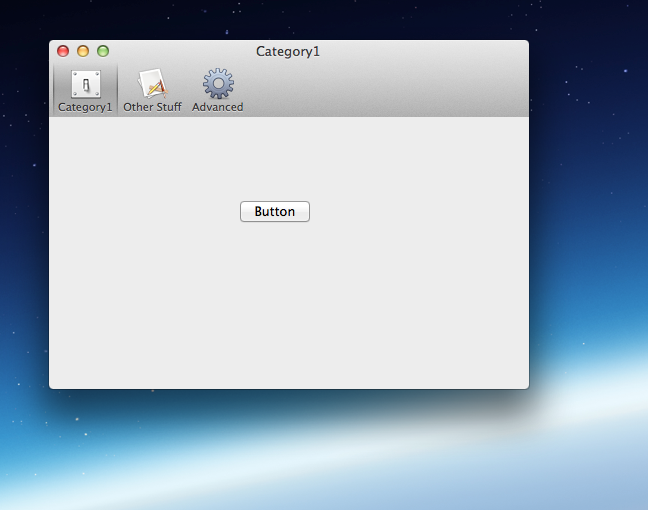

# TSCToolBarSettingsController

For sure you know the preferences from Safari or Mail, don't you? Apple doesn't provide any simple and quick way to implement them. It is annoying to write for each app the almost same code again and again just to implement this. In addition, the ViewControllers will blow up unnecessary. Or maybe you're new at Cocoa and you don't know how to do.

This project is dedicated to fill this gap. It provides a simple interface to create such app preferences in an easy and quick way.



## Installation

Simply drag and drop the .h and .m file from the ```TSCToolBarSettingsController``` into your project.

## Usage

First design your toolbar. Create a new xib file with a window in it and drag a ```NSToolbar``` in the window. Then drag the ```NSToolbarItems``` you need in this toolbar. Give them a picture, a label and an identifier. Then double-click on the toolbar and remove the items you don't want completely. Also you have to remove EVERY item from the ```Default Toolbar Items```, including your owns.
>When you use more than one toolbar in your app, you MUST give the toolbar an unique identifier. When you don't do so, Cocoa will keep the toolbars in sync, which will lead to strange results.

Then create for each settings tab a new view. You can do this in the same xib or in a new one. Important is that you activate Autolayout and disable "Translates Mask into Constraints". Design these views and create their view controllers.

As last step you have to connect these things. For this switch to your preference's window windowController. In ```windowDidLoad``` you finally have to configure the TSCToolBarSettingsController.
This a an excerpt of the demo:
```objective-c
- (void)windowDidLoad
{
    [super windowDidLoad];
    
//Create the view controller of your content views. Instead of NSViewController you should use your own subclass.
    self.category1Controller = [[NSViewController alloc]initWithNibName:@"Preferences_Category1View" bundle:nil];
    self.otherStuffController = [[NSViewController alloc]initWithNibName:@"Preferences_OtherStuffView" bundle:nil];
    self.advancedController = [[NSViewController alloc]initWithNibName:@"Preferences_AdvancedView" bundle:nil];
    
//Create the TSCToolBarSettingsController    
    self.controller = [[TSCToolBarSettingsController alloc]initWithWindow:self.window];

//Finally add your content views to the controller    
    [self.controller addSubView:self.category1Controller.view ToolbarItemIdentifier:@"Category1"];
    [self.controller addSubView:self.otherStuffController.view ToolbarItemIdentifier:@"Other Stuff"];
    [self.controller addSubView:self.advancedController.view ToolbarItemIdentifier:@"Advanced"];
}
```
The ToolbarItemIdentifier is the identifier you set for the ToolbarItems in Interface Builder.

### Known problems

* With some content views the switch animation doesn't work correctly. The toolbar seems to slide from somewhere down to its position. 
I figured out a workaround for this. When this happen, just call in ```windowDidLoad``` this:
```addItemIdentifierWhichNeedsWorkaround: (NSString*) identifier``` This will fix it.

* When the user selects in Application Menu ```View --> Hide Toolbar``` there will be some strange glitches. Solution? Just remove the menu entry.

### Troubleshooting

* Your ViewController's view is nil? Make sure that you set the FileOwner's class in the xib to your ViewController AND connected its ```view``` outlet to your view.

## Contributing

* Create something awesome, make the code better or add some functionality,
  whatever (this is the hardest part).
* [Fork it](http://help.github.com/forking/)
* Create new branch to make your changes
* Commit all your changes to your branch
* Submit a [pull request](http://help.github.com/pull-requests/)

## Licence

Copyright (C) 2014 Jonathan Rahn

Permission is hereby granted, free of charge, to any person obtaining a copy of this software and associated documentation files (the "Software"), to deal in the Software without restriction, including without limitation the rights to use, copy, modify, merge, publish, distribute, sublicense, and/or sell copies of the Software, and to permit persons to whom the Software is furnished to do so, subject to the following conditions:

The above copyright notice and this permission notice shall be included in all copies or substantial portions of the Software.

THE SOFTWARE IS PROVIDED "AS IS", WITHOUT WARRANTY OF ANY KIND, EXPRESS OR IMPLIED, INCLUDING BUT NOT LIMITED TO THE WARRANTIES OF MERCHANTABILITY, FITNESS FOR A PARTICULAR PURPOSE AND NONINFRINGEMENT. IN NO EVENT SHALL THE AUTHORS OR COPYRIGHT HOLDERS BE LIABLE FOR ANY CLAIM, DAMAGES OR OTHER LIABILITY, WHETHER IN AN ACTION OF CONTRACT, TORT OR OTHERWISE, ARISING FROM, OUT OF OR IN CONNECTION WITH THE SOFTWARE OR THE USE OR OTHER DEALINGS IN THE SOFTWARE.

